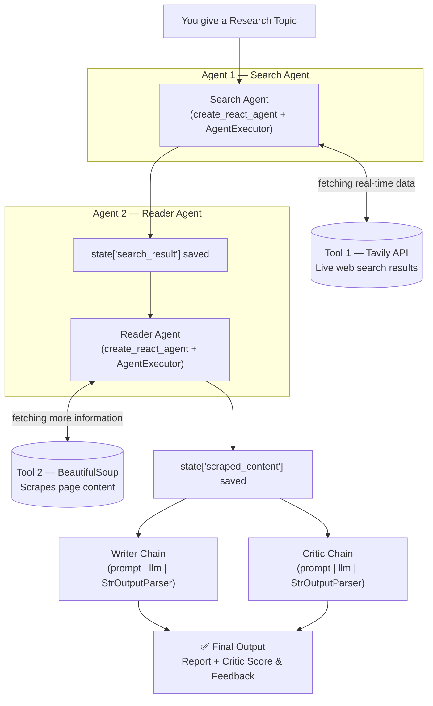

# 🧠 ResearchMind — Multi-Agent Research System

A fully autonomous AI research assistant. Instead of a single model answering from memory, ResearchMind deploys a **team of four specialized agents** — Search, Reader, Writer, and Critic — that collaborate through a shared state to search the live web, extract real content, write a structured report, and grade their own work, just like a senior researcher reviewing a junior's draft.

This is not a chatbot and not a simple Q&A tool — it's a small production-style agentic pipeline built with **LangChain**, **LCEL**, and **live web tools**.

---

## ✨ What it does

1. You give it a research topic.
2. The **Search Agent** goes out on the live internet (via the Tavily API) and finds the most relevant, recent sources.
3. The **Reader Agent** visits those sources and scrapes/extracts the actual readable content (via BeautifulSoup).
4. The **Writer Chain** takes everything gathered and writes a well-structured, detailed research report.
5. The **Critic Chain** reviews that report like a senior researcher — scoring it and giving feedback.
6. You get back a final report **plus** a critique of how good the research really is.

Every agent is powered by an LLM, connected through LangChain's modern **LCEL** pipe syntax, and orchestrated through a **shared state dictionary** so all four agents work as one unified brain.

---

## 🏗️ Architecture



**How data flows:**

| Step | Component | What happens |
|------|-----------|---------------|
| 1 | User input | You provide a research topic |
| 2 | **Search Agent** | Calls the `web_search` tool (Tavily API) to get live, relevant links + snippets. Result is saved to `state['search_result']` |
| 3 | **Reader Agent** | Calls the `scrape_url` tool (BeautifulSoup) on the most relevant link(s) to extract clean, detailed page content. Result is saved to `state['scraped_content']` |
| 4 | **Writer Chain** | An LCEL chain (`prompt \| llm \| StrOutputParser()`) turns the search + scraped data into a full, structured research report |
| 5 | **Critic Chain** | A second LCEL chain reviews the report, scores it, and gives feedback — judging both the research quality and how good the report itself is |
| 6 | **Final Output** | The report and the critic's feedback are returned together |

---

## 🛠️ Tech stack

- **Python**
- **LangChain** — agent orchestration (`create_react_agent`, `AgentExecutor`, LCEL pipes)
- **Tavily API** — live web search
- **BeautifulSoup** — web scraping / content extraction
- **OpenAI (or your chosen LLM provider)** — powers all four agents/chains
- **python-dotenv** — environment variable management

---

## 📁 Project structure

```
.
├── app.py                # Application entry point (runs the pipeline / serves the UI)
├── agents.py              # Search Agent, Reader Agent, Writer Chain, Critic Chain definitions
├── tools.py                # Custom @tool-decorated tools: web_search (Tavily), scrape_url (BeautifulSoup)
├── pipeline.py              # run_research_pipeline() — the supervisor that calls all 4 agents in order
├── requirements.txt          # Python dependencies
├── .env                        # API keys (OpenAI, Tavily) — NOT committed
├── .gitignore
└── README.md
```

### What each file is responsible for

- **`tools.py`** — Builds two custom tools using the `@tool` decorator:
  - `web_search` — talks to the Tavily API and fetches live search results for a query.
  - `scrape_url` — takes a URL, visits it, and extracts clean readable text using BeautifulSoup.

- **`agents.py`** — The heart of the project. Defines:
  1. **Search Agent** — `create_react_agent` + `AgentExecutor`, using the `web_search` tool.
  2. **Reader Agent** — same pattern, using the `scrape_url` tool.
  3. **Writer Chain** — modern LCEL syntax: `prompt | llm | StrOutputParser()`, turns all gathered research into a full report.
  4. **Critic Chain** — LCEL pipe that reads the report and returns a score + feedback.

- **`pipeline.py`** — The supervisor. One function, `run_research_pipeline(topic)`, calls all four agents/chains in the correct order and passes results between them via a shared `state` dictionary. Prints each step's output as it goes, so you can see exactly what each agent is doing.

- **`app.py`** — Entry point that runs the pipeline against a topic and surfaces the final output.

---

## ⚙️ Setup

### Step 1 — Environment setup
```bash
python -m venv venv
venv\Scripts\activate        # Windows
source venv/bin/activate     # macOS/Linux

pip install -r requirements.txt
```

Create a `.env` file in the project root with your API keys:
```
OPENAI_API_KEY=your_openai_key_here
TAVILY_API_KEY=your_tavily_key_here
```

### Step 2 — Tools (`tools.py`)
Two custom tools, built with the `@tool` decorator:
- `web_search` — talks to the Tavily API, fetches live search results.
- `scrape_url` — visits a URL and extracts clean readable text with BeautifulSoup.

### Step 3 — Agents (`agents.py`)
- **Search Agent** — `create_react_agent` + `AgentExecutor`, uses `web_search`.
- **Reader Agent** — same pattern, uses `scrape_url`.
- **Writer Chain** — LCEL: `prompt | llm | StrOutputParser()`.
- **Critic Chain** — LCEL: reads the report, returns score + feedback.

### Step 4 — Pipeline (`pipeline.py`)
One function, `run_research_pipeline`, calls all four agents/chains in order, passing results through a shared `state` dict, printing each step's output along the way.

### Step 5 — Run and test
```bash
python pipeline.py
```
Enter a research topic and watch all four agents work one by one — search, read, write, review — ending with the final report and critic feedback printed to the terminal.

---

## ▶️ Usage

```bash
python app.py
```

Give it a topic (e.g. *"Quantum computing breakthroughs in 2025"*) and it will:
1. Search the live web for relevant sources
2. Scrape the most relevant one for deep content
3. Write a full research report
4. Critique and score that report

You'll get the final report plus the critic's feedback back.

---

## 🔒 Notes

- `.env`, `venv/`, `__pycache__/`, and log files are excluded via `.gitignore` — **never commit API keys**.
- This is a learning/portfolio project demonstrating multi-agent orchestration with LangChain — contributions and issues are welcome.

---

## 📄 License

Add your preferred license here (e.g. MIT).
